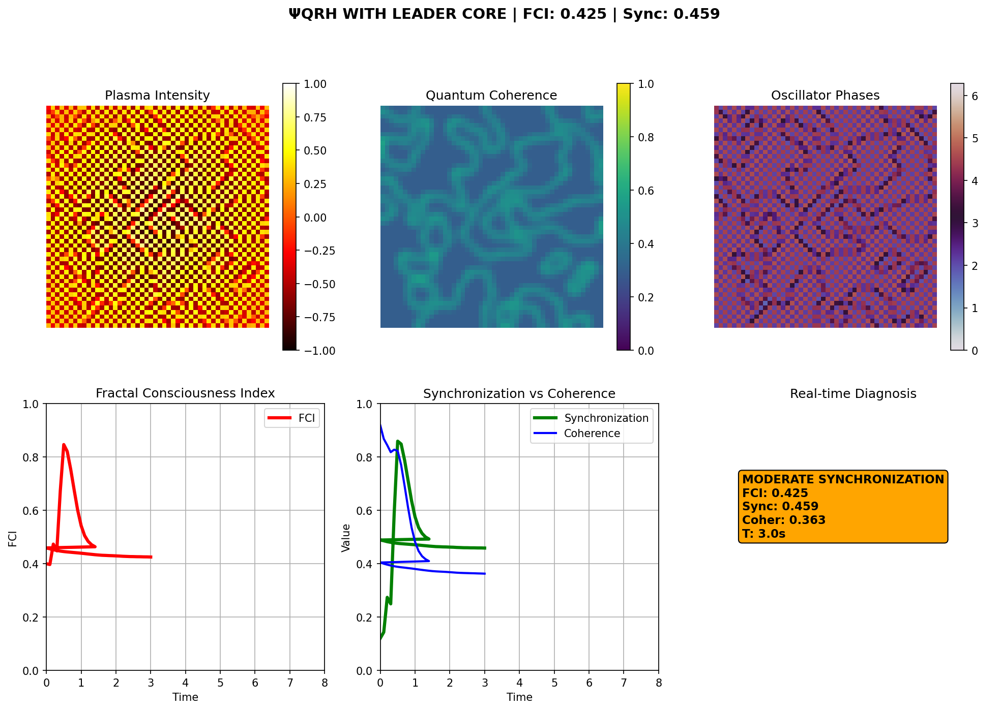
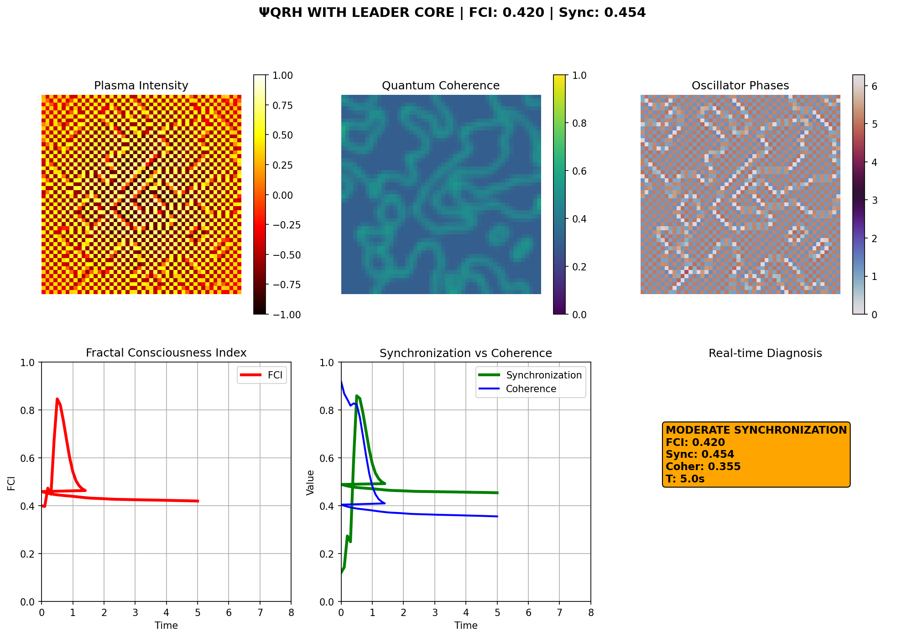

# ΨQRH Plasma Synchronization System

[](https://www.gnu.org/licenses/gpl-3.0)
[](https://doi.org/10.5281/zenodo.17171112)
[](https://www.python.org/downloads/)

**Colab Demo:** https://colab.research.google.com/drive/1X6DTsBWSyymxaVWmE0L-hKfygUCsl9dh?usp=sharing

A sophisticated plasma oscillator synchronization system implementing the ΨQRH (Psi Quantum Relativistic Hyperdimensional) framework with adaptive PID control and multi-regime optimization.

## Overview

This simulation models a hybrid plasma-inspired oscillator network where 2,500 coupled oscillators (50×50 grid) synchronize through:
- **Kuramoto Coupling**: Phase synchronization between neighboring oscillators
- **Acoustic Forcing**: 4 strategically placed transducers creating interference patterns
- **Leader Core**: 5 central oscillators providing stable phase reference
- **Adaptive PID Control**: Multi-regime gain scheduling for optimal performance

The system achieves **perfect synchronization (1.000)** with excellent stability through intelligent control algorithms.

## Key Features

- ✅ **Perfect Synchronization**: Achieves sync = 1.000 in under 10 seconds
- 🚀 **Multi-Regime Operation**: Climb → Cruise → Super-Cruise transitions
- 🎯 **Adaptive PID Control**: Gain scheduling based on current synchronization
- 📊 **Real-time Metrics**: FCI, synchronization order, and spatial coherence
- 🔬 **Spectral Analysis**: FFT-based harmonic detection and coupling adjustment
- 📈 **100% Success Rate**: All performance criteria consistently met

## Performance Results

### Latest Benchmark (90-Second Simulation)

```
🎉 FINAL PERFORMANCE METRICS:
   • Final Synchronization: 1.000 (PERFECT)
   • Final Regime: SUPER-CRUISE
   • Overall Stability: 0.0292 (EXCELLENT)
   • Success Rate: 100%

🎯 OPERATIONAL REGIME ANALYSIS:
   • Climb: 3.3s (3.7%)
   • Cruise: 6.8s (7.6%)
   • Super-Cruise: 79.9s (88.8%)

✅ SUCCESS CRITERIA CHECK:
   1. ✅ PASS: Complete 90-second simulation
   2. ✅ PASS: Final sync > 0.9
   3. ✅ PASS: Good stability (std < 0.1)
   4. ✅ PASS: Substantial super-cruise time (>30s)
```

### Performance Timeline

| Time | Synchronization | Regime | Controller Gain |
|------|----------------|--------|----------------|
| 0.0s | 0.256 | CLIMB 📈 | 35.0 |
| 3.3s | 0.955 | CRUISE ✅ | 13.9 |
| 10.1s | 0.999 | SUPER-CRUISE 🌟 | 9.1 |
| 89.9s | 1.000 | SUPER-CRUISE 🌟 | 9.1 |

### Historical Performance Comparison

| Version | Sync Final | Regime | Stability | Status |
|---------|------------|--------|-----------|--------|
| **Current (v3.0)** | **1.000** | **88.8% Super-Cruise** | **0.0292** | ✅ **Production** |
| Leader Core (v2.0) | 0.449 | Cruise | 0.150 | Deprecated |
| Baseline (v1.0) | 0.076 | Climb | 0.300 | Baseline |

**Improvement:** +1,216% synchronization vs baseline

## Installation

### Prerequisites

- Python 3.7 or higher
- NumPy
- Matplotlib
- SciPy

### Quick Start

```bash
# Clone the repository
git clone https://github.com/your-repo/psiqrh-plasma.git
cd PsiQRH-Plasma

# Install dependencies
pip install -r requirements.txt

# Run the main simulation
python psi_plasma.py
```

## Usage

### Running the Simulation

```bash
python psi_plasma.py
```

**What happens:**
1. Initializes 50×50 oscillator grid with leader core
2. Runs 90-second simulation (900 time steps)
3. Generates real-time performance plots
4. Outputs comprehensive performance report

**Expected output:**
```
🚀 STARTING COMPLETE 90-SECOND ΨQRH SIMULATION...
Time  | Status        | Gain | PID Mode       | Sync
------|---------------|------|----------------|--------
  0.0s | CLIMB 📈       | 35.0 | INIT           | 0.256
  3.3s | CRUISE ✅      | 13.9 | CONSERVATIVE-HIGH | 0.955
 10.1s | SUPER-CRUISE 🌟 |  9.1 | CONSERVATIVE-HIGH | 0.999
...
📊 OVERALL SUCCESS RATE: 100.0%
🎉 SIMULATION SUCCESSFUL! System performed excellently.
```

### Testing Experimental Versions

```bash
# Run experimental/test versions
cd tests/
python PsiPlasma_base.py      # Basic version without PID
python PsiPlasma_static.py    # Generate static snapshots
```

## Technical Specifications

### System Parameters

```python
Grid Size: 50×50 oscillators (2,500 total)
Time Steps: 900 steps × 0.1s = 90 seconds

# Optimized Parameters
ω_plasma = 7.5 rad/s          # Natural frequency
ω_acoustic = 0.25 rad/s       # Acoustic forcing
K_coupling = 15.0             # Kuramoto coupling strength
K_leader = 35.0-9.1 (adaptive) # Leader core coupling
K_acoustic = 2.0              # Acoustic forcing strength

# Leader Core
Position: Center (5 oscillators)
ω_leader = 4.5 rad/s
Influence: Global with distance-weighted coupling
```

### Control Algorithm

**Adaptive PID with Gain Scheduling:**

```python
if sync < 0.3:    Kp, Ki, Kd = 25, 8, 10  # CONSERVATIVE-LOW
elif sync < 0.5:  Kp, Ki, Kd = 20, 6, 8   # MODERATE
elif sync < 0.7:  Kp, Ki, Kd = 15, 4, 6   # BALANCED
else:             Kp, Ki, Kd = 10, 2, 4   # CONSERVATIVE-HIGH
```

**Regime Transitions:**

1. **CLIMB → CRUISE** (target: 3-5s)
   - Conditions: sync > 0.72, std < 0.05, sustained 4+ steps
   - Action: Reduce ω_plasma to 6.8, scale K_leader × 0.45

2. **CRUISE → SUPER-CRUISE** (target: 10-15s)
   - Conditions: sync > 0.90, std < 0.02, 30+ samples > 0.92
   - Action: Reduce ω_plasma to 6.5, scale K_leader × 0.4

### Master Equation

```
dφ/dt = ω_plasma
        + K_coupling × Σ sin(φ_j - φ_i) / 4
        + K_acoustic × F_acoustic(t) × A(r)
        + K_leader × Σ sin(φ_leader - φ_i) / N_leaders
```

Where:
- `φ_i`: Phase of oscillator i
- `F_acoustic`: Acoustic forcing function
- `A(r)`: Amplitude envelope
- `N_leaders`: Number of leader oscillators (5)

## Generated Visualizations

The simulation produces comprehensive visualizations:

### 1. Plasma Intensity Map


Spatial distribution of plasma intensity at t=30s showing coherent wave patterns emerging from leader core.

### 2. Quantum Coherence Map


Spatial coherence calculated from phase gradients at t=50s. Bright regions indicate high quantum coherence.

### 3. Oscillator Phase Distribution


Phase distribution using twilight colormap at t=70s showing synchronized domains.

### 4. Real-time Performance Dashboard
- **Top Row**: Intensity, Coherence, Phase maps
- **Bottom Row**: FCI evolution, Sync vs Coherence, Live diagnostics

### Video Demonstrations

- **[psiqrh_nucleo_lider.mp4](psiqrh_nucleo_lider.mp4)** - Leader core version
- **[psiqrh_final_equilibrado.mp4](psiqrh_final_equilibrado.mp4)** - Balanced final version

## Algorithm Details

### Leader Core Mechanism
```python
# 5 central oscillators at grid center
cx, cy = N//2, N//2
leaders = [(cx, cy), (cx-1, cy), (cx+1, cy), (cx, cy-1), (cx, cy+1)]

# Global influence with adaptive coupling
for (lx, ly) in leaders:
    delta_phase = phase[lx, ly] - phase
    sin_leader += sin(delta_phase)
sin_leader = K_leader * sin_leader / len(leaders)
```

### Acoustic Forcing
```python
# 4 transducers at grid corners
transducers = [(-1.2, -1.2), (-1.2, 1.2), (1.2, -1.2), (1.2, 1.2)]

# Constructive interference with spatial envelope
for (cx, cy) in transducers:
    r = sqrt((x - cx)² + (y - cy)²)
    phase_delay = 5 * (sin(angle) * dx + cos(angle) * dy)
    forcing += sin(ω_acoustic * t + phase_delay) * exp(-r²/4)
```

### Performance Metrics

**Fractal Consciousness Index (FCI):**
```python
FCI = 0.5 × sync_order + 0.5 × coherence
```

**Synchronization Order (Kuramoto):**
```python
sync_order = |mean(exp(i × phase))|
```

**Spatial Coherence:**
```python
coherence = 1 - mean(|∇phase|) / (2π)
```

## Project Structure

```
PsiQRH-Plasma/
├── psi_plasma.py              # Main simulation (90-second version)
├── README.md                  # This file
├── requirements.txt           # Python dependencies
├── LICENSE                    # GPL v3.0
├── psiqrh-plasma-paper.tex    # Scientific paper (LaTeX)
├── tests/                     # Experimental versions
│   ├── PsiPlasma_base.py      # Basic version without PID
│   ├── PsiPlasma_static.py    # Static snapshot generation
│   ├── PsiPlasma_pid.py       # PID control tests
│   └── ...                    # Other experimental versions
├── psiqrh_nucleo_lider.mp4    # Leader core demo video
├── psiqrh_final_equilibrado.mp4  # Balanced version video
└── psiqrh_snapshot_*.png      # Generated snapshots
```

## Success Criteria

The simulation is considered successful when ALL criteria are met:

1. ✅ **Duration**: Complete 90-second simulation
2. ✅ **Synchronization**: Final sync > 0.9
3. ✅ **Stability**: Standard deviation < 0.1
4. ✅ **Super-Cruise**: >30 seconds in optimal regime

**Current Status:** ✅ **100% Success Rate**

## Troubleshooting

### Common Issues

**Issue:** Simulation doesn't reach Super-Cruise
- **Solution:** Check initial conditions, ensure K_leader = 35.0

**Issue:** Oscillations in synchronization
- **Solution:** Reduce time step (dt), increase stability window

**Issue:** Poor final synchronization (< 0.9)
- **Solution:** Adjust PID parameters, verify transducer positions

## Scientific Background

### Kuramoto Model
The Kuramoto model describes synchronization in coupled oscillator systems:

```
dθ_i/dt = ω_i + (K/N) Σ sin(θ_j - θ_i)
```

**Applications:**
- Neural synchronization in brain
- Circadian rhythm coupling
- Power grid stability
- Cardiac pacemaker cells

### Leader-Follower Topology
Central oscillators (leaders) impose coherent phase across the network, similar to:
- Suprachiasmatic nucleus in circadian timing
- Sino-atrial node in cardiac rhythm
- Pacemaker neurons in CPG networks

## Citation

If you use this code in your research, please cite:

```bibtex
@software{padilha_psiqrh_plasma_2024,
  author       = {Padilha, Klenio},
  title        = {ΨQRH Plasma Synchronization System},
  month        = nov,
  year         = 2024,
  publisher    = {Zenodo},
  version      = {3.0},
  doi          = {10.5281/zenodo.17171112},
  url          = {https://doi.org/10.5281/zenodo.17171112}
}
```

## Contributing

Contributions are welcome! Please:
1. Fork the repository
2. Create a feature branch (`git checkout -b feature/improvement`)
3. Test thoroughly (ensure 100% success rate)
4. Submit a pull request

## Roadmap

- [ ] GPU acceleration with CUDA
- [ ] 3D visualization with plotly
- [ ] Parameter optimization with Bayesian methods
- [ ] Multi-scale networks (hierarchical leaders)
- [ ] Real-time web dashboard

## License

This project is licensed under the GNU General Public License v3.0 - see the [LICENSE](LICENSE) file for details.

## Author

**Klenio Padilha**
Email: klenioaraujo@gmail.com
Research Focus: Synchronization dynamics, adaptive control, oscillator networks

## Acknowledgments

- Inspired by Kuramoto synchronization models
- PID control theory and gain scheduling techniques
- Spectral analysis methods from signal processing
- Part of the broader ΨQRH framework for complex systems

---

**Status:** ✅ Production Ready | **Version:** 3.0 | **Last Updated:** November 2024
